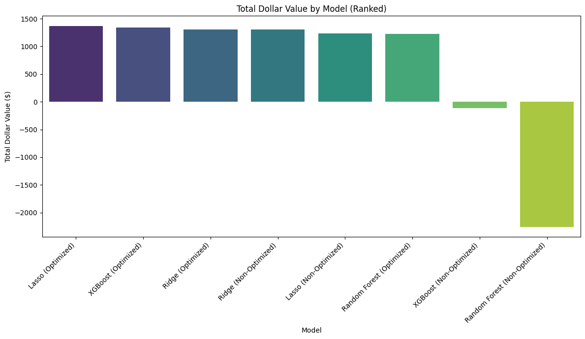
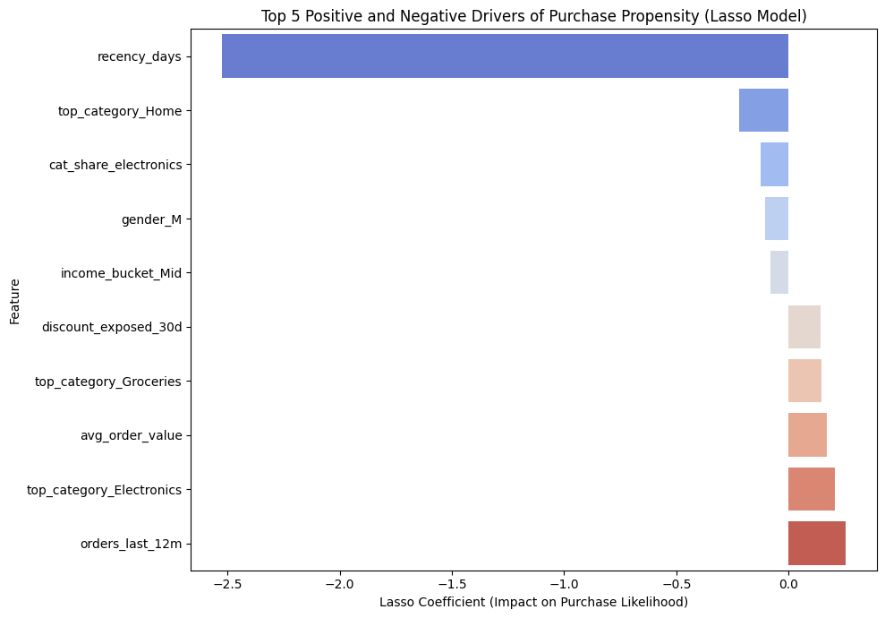

# Purchase Propensity Model for ShopNow

This project builds a customer purchase propensity model for **ShopNow**, an e-commerce retailer that wants to identify customers most likely to purchase in the next 30 days and maximize the business value of targeted marketing campaigns.

Using customer demographics, purchase behavior, engagement metrics, and category-level spending patterns, this project compares multiple machine learning models and selects the one that delivers the highest expected marketing profit under a cost-based evaluation framework.

---

## Project Objective

The goal of this project is to:

- Predict whether a customer will purchase in the next 30 days
- Compare multiple classification models
- Evaluate models using both predictive performance and business impact
- Recommend a targeting strategy for ShopNow’s marketing team

Rather than selecting a model based only on accuracy, this project uses a business payoff matrix to identify the model that generates the highest expected dollar value.

---

## Dataset

The repository includes the full public dataset:

- `ShopNow-Dataset.csv`

Each row represents a unique customer and includes variables such as:

- Age
- Gender
- Income bucket
- Orders in the last 12 months
- Days since last purchase
- Average order value
- Website visits in the last 30 days
- Email opens in the last 90 days
- Top spending category
- Category share variables
- Discount exposure
- Purchase flag for next 30 days

The target variable is **imbalanced**, with approximately **23% purchasers** and **77% non-purchasers**, which influenced both the validation strategy and model design.

---

## Repository Structure

```text
Purchase-propensity-model/
├── ShopNow-Dataset.csv
├── Purchase-Propensity-Analysis-Report.pdf
├── Purchase-Propensity-Analysis_code.pdf
├── images/
│   ├── model-dollar-value.png
│   ├── lasso-drivers.png
│   └── class-imbalance.png
└── README.md
```

---

## Modeling Approach

### 1. Data Preparation

The following preprocessing steps were applied:

- Dropped non-predictive columns such as `customer_id` and free-text feedback
- Winsorized skewed RFM-related variables to reduce outlier influence
- Standardized numeric features for regularized linear models
- One-hot encoded categorical variables such as gender, income bucket, and top category
- Used a stratified 80/20 train-test split to preserve the purchase rate across samples

### 2. Models Compared

Four classification models were trained and evaluated:

- **Ridge Classifier (L2 regularization)**
- **Lasso Logistic Regression (L1 regularization)**
- **Random Forest**
- **XGBoost**

Ridge and Lasso were included as interpretable, regularized baselines that handle multicollinearity well. Random Forest and XGBoost were used to capture non-linear relationships and feature interactions.

### 3. Class Imbalance Handling

Because purchasers were the minority class, imbalance was handled using:

- `class_weight='balanced'` for Ridge, Lasso, and Random Forest
- `scale_pos_weight` for XGBoost

### 4. Validation Strategy

- Stratified train-test split
- 5-fold cross-validation on training data
- Final evaluation on a held-out test set

---

## Evaluation Framework

Models were evaluated using standard classification metrics for the purchase class:

- Accuracy
- Precision
- Recall
- F1-score

Because missing a likely purchaser is more costly than targeting a non-purchaser, this project also evaluates models using the following payoff structure:

- **True Positive (TP): +15**
- **False Positive (FP): -5**
- **True Negative (TN): 0**
- **False Negative (FN): -10**

This business framing helps align model selection with expected profit rather than relying only on predictive accuracy.

---

## Model Performance

| Model | Accuracy | Precision | Recall | F1-Score | Total Dollar Value |
|---|---:|---:|---:|---:|---:|
| Lasso (Optimized) | 61% | 36% | 93% | 52% | $1,370 |
| XGBoost (Optimized) | 57% | 34% | 97% | 51% | $1,340 |
| Ridge (Optimized) | 58% | 35% | 95% | 51% | $1,305 |
| Ridge (Non-Optimized) | 58% | 35% | 95% | 51% | $1,305 |
| Lasso (Non-Optimized) | 64% | 37% | 88% | 52% | $1,235 |
| Random Forest (Optimized) | 61% | 36% | 91% | 51% | $1,230 |
| XGBoost (Non-Optimized) | 69% | 38% | 58% | 45% | -$110 |
| Random Forest (Non-Optimized) | 78% | 52% | 8% | 14% | -$2,260 |

### Key Takeaway

Although Random Forest had the highest baseline accuracy, it performed poorly on recall and produced negative business value. The **optimized Lasso model** delivered the **highest total dollar value**, making it the best model for marketing decision-making.

---

## Visuals

### Total Dollar Value by Model



This chart compares model performance using business impact rather than accuracy alone. It shows that optimized Lasso generated the highest expected dollar value, followed closely by optimized XGBoost and Ridge.

### Top Drivers of Purchase Propensity



The Lasso model provides interpretable coefficients that help explain which variables most influence short-term purchase likelihood.

---

## Business Insights

The best-performing model suggests that customers are more likely to purchase when they show signs of strong recent engagement and purchase behavior.

Key positive drivers include:

- Lower recency (more recent activity)
- Higher number of orders in the last 12 months
- Higher average order value
- More website visits
- More email opens
- Discount exposure
- Higher spending concentration in categories such as Electronics and Groceries

These results suggest that purchase likelihood is driven not just by demographics, but by recent activity, prior value, and engagement behavior.

---

## Recommendations

Based on the final model, ShopNow’s marketing team should:

- Use the **optimized Lasso model** as the primary targeting engine for next-30-day campaigns
- Prioritize customers above the optimized probability threshold
- Rank high-propensity customers to allocate premium offers more efficiently
- Use discounts more selectively, especially for already engaged customers
- Test model-based targeting against a simpler heuristic approach through A/B experiments

For medium-propensity customers just below the threshold, lighter-touch nudges such as reminder emails or content-based promotions may be more efficient than large discounts.

---

## Why Lasso Won

The optimized Lasso model performed best because it balanced three important needs:

- Strong recall on likely purchasers
- Positive and interpretable feature effects
- Highest expected profit after threshold tuning

This project also shows that **threshold optimization matters as much as model choice**. More complex models did not necessarily create more value unless their classification threshold was aligned with business costs.

---

## Files Included

- `ShopNow-Dataset.csv` — source dataset
- `Purchase-Propensity-Analysis-Report.pdf` — final business report

---

## Tools and Libraries

- Python
- pandas
- NumPy
- SciPy
- scikit-learn
- XGBoost
- Matplotlib
- Seaborn
- Jupyter Notebook

---

## Next Steps

Potential future enhancements include:

- Adding text-based features from customer feedback
- Retraining on fresh cohorts over time
- Calibrating probabilities for production use
- Comparing this approach with uplift modeling or campaign response modeling
- Validating impact through live A/B testing

---

## Author

**Ammratansh Ghildyal**  
MS Business Analytics, University of Illinois Urbana-Champaign

If you found this project interesting, feel free to explore the report and code files in this repository.
